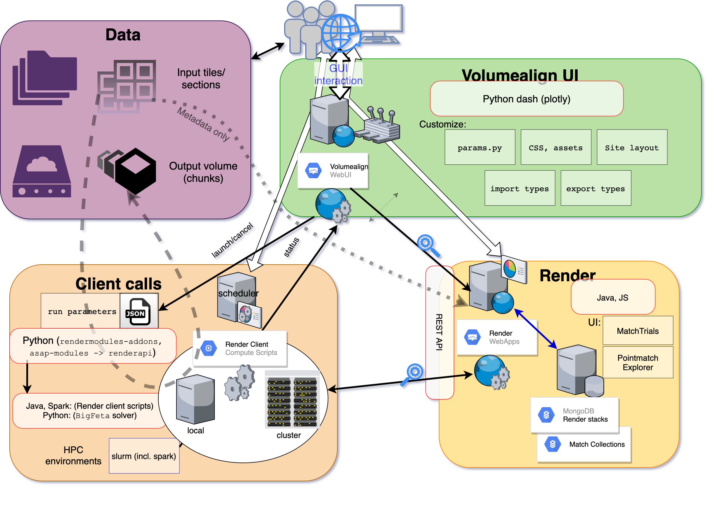

# Alignment tools for large volume-EM data

## Overview

The key concept of the alignment tools for large-volume EM data is that the procedure will not touch the underlying tile data but only process the associated metadata.
Once the alignment is satisfying, an export/materialisation of the transformed data is performed to produce the final result (chunked volume data).

The alignment infrastructure is based on four independent core modules.

### A MogoDB server

This database server hosts two key databases that store all relevant information for the alignment.
- The metadata specifications for each stack
- The collection of feature matches for each tile (pair-wise)

### The Render web services

This runs the API and web interface to the database. All metadata and data-related queries are handled by this interface.

### The Client (scripts)

This is where all computation is done. The core library is Java-based and part of the render distribution.
Client scripts communicate with the Render web services and operate on the image data or metadata. They can be run as standalone executables or through a HPC scheduler.

### The Web frontend (Volumealign UI)

This is a WebUI that provides intuitive graphical access to users. It connects with the render web services and supervises the execution of client scripts. It is built in Python/dash.

## Hardware setup

At EMBL, we run the database and the Render web services on a single machine.
Also, the WebUI runs on the cluster submission node, so the scheduler requests can be directly issued to the HPC infrastructure.

