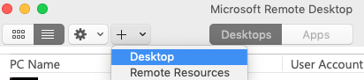
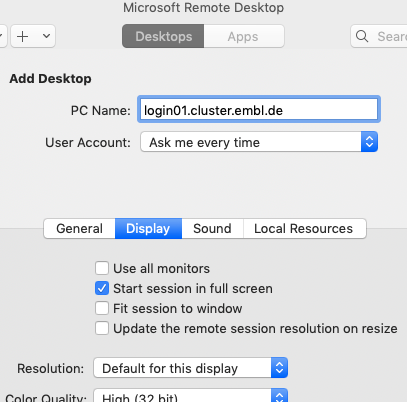
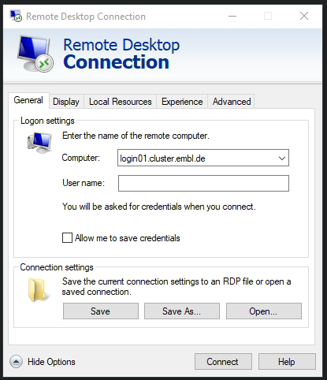
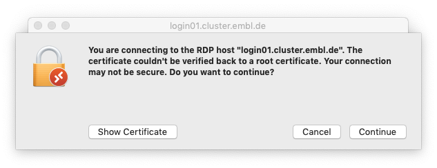
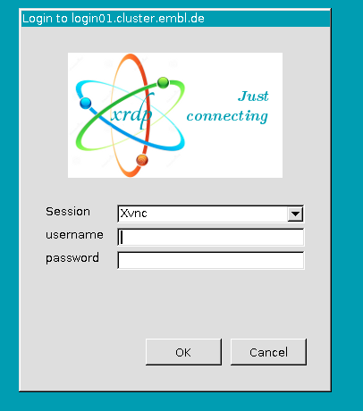
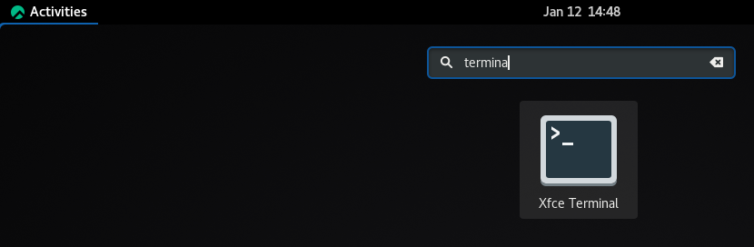
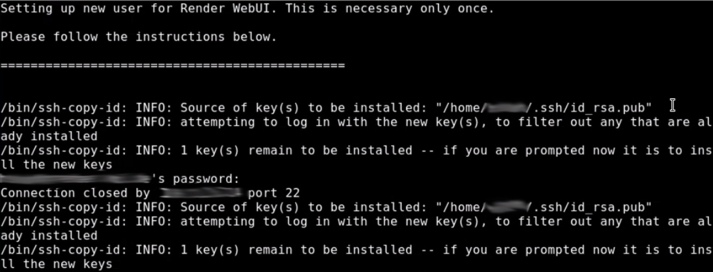
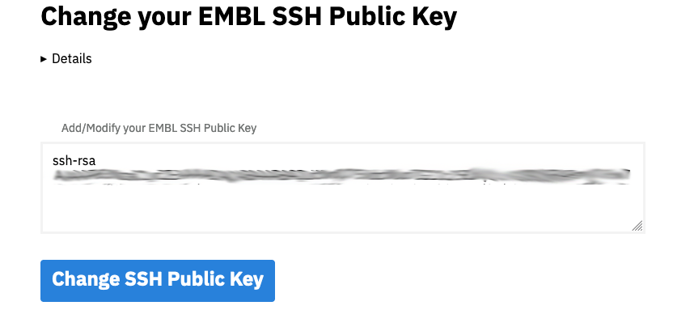

# Start the Render web UI on the EMBL Cluster

This tutorial explains how to launch the Render WebUI for running computations.

It makes use of the graphical login procedure for the EMBL cluster, described at https://wiki.embl.de/cluster/Env.


## Setting up the remote Desktop

The connection to a graphical login node of the EMBL cluster uses RDP (https://en.wikipedia.org/wiki/Remote_Desktop_Protocol).

This is the built-in remote control in Microsoft Windows.

In order to use the connection from a Mac you need to install the client software from https://apps.apple.com/app/microsoft-remote-desktop/id1295203466?mt=12 .

If you have trouble with the App store, try downloading it from https://www.macupdate.com/app/mac/8431/microsoft-remote-desktop/old-versions .

***

### MacOS 

To initially set up the connection, click the plus logo to add a new PC ("Desktop" in older versions).



Provide the address `login01.cluster.embl.de` and optionally choose your desired display settings for the connection.



### Windows
Open the software **Remote Desktop Connection**. Provide the address `login01.cluster.embl.de` and optionally choose your desired display settings for the connection.




***

Once you have set up the connection, you can just launch it by double-clicking its entry in the list of the Remote Desktop main window. You can ignore the certificate warning that might show up.



Provide your EMBL login and password in the login window. 



At the moment there is no desktop loaded automatically. To start the desktop, click "Activities" in the top left corner.



Type `terminal` in the search box and launch the "Xfce Terminal program".
This will start a terminal session. In there type 

```
cp -r /g/emcf/schorb/code/admin_scripts/autostart ~/.config/ | xfdesktop
```

and hit enter to launch the desktop. Keep this terminal window open for the duration of this session.

## Launching Render


You should find an icon called `Render WebUI` on your desktop.


If you don't (some more recent EMBL users might need that), open a terminal by right-clicking in an empty area of the desktop and selecting `Open Terminal here`.
Then copy and paste this command and execute it by pressing `Return`.

```
cp /g/emcf/schorb/code/admin_scripts/Render_WebUI.desktop ~/Desktop
```

Now, the desktop icon should be there.

When you launch the program by double-clicking the icon, a terminal window will appear.

If you are launching it for the very first time, a couple of steps need to be done to set you up for processing on a cluster or multiple remote workstations.
It needs to generate and deploy secure keys to allow your tasks to be run on multiple machines without the need of providing your password for login every time.
If initially you are asked for a `passphrase`, leave it empty (2x).
Then, please type your password once for each workstation/computational resource to initiate that procedure.



Be careful **not** to use `CTRL + C` for copying text as this key combination will terminate the procedure!
At EMBL, you also need to copy your public key yhat it shows you into the box on this website.

https://pwtools.embl.de/sshkey



When done and when launching the server for the next times, the following window appears:


You can now connect to the web address shown with any browser. Be careful **not** to use `CTRL + C` for copying text as this key combination will terminate the server you've just started.

To close the WebUI and terminate the server, just close that window.

## Interrupting sessions

When you run a long processing, there is no need to stay connected remotely to the server all the time. You can simply disconnect from the VPN and re-connect at any later time. The session will continue to run as it is.
If you are done, to close your session, click the power button in the top right corner, click on your name and then log out.

## Happy processing!
