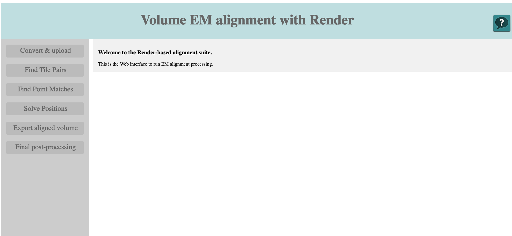
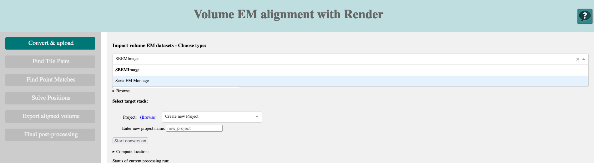
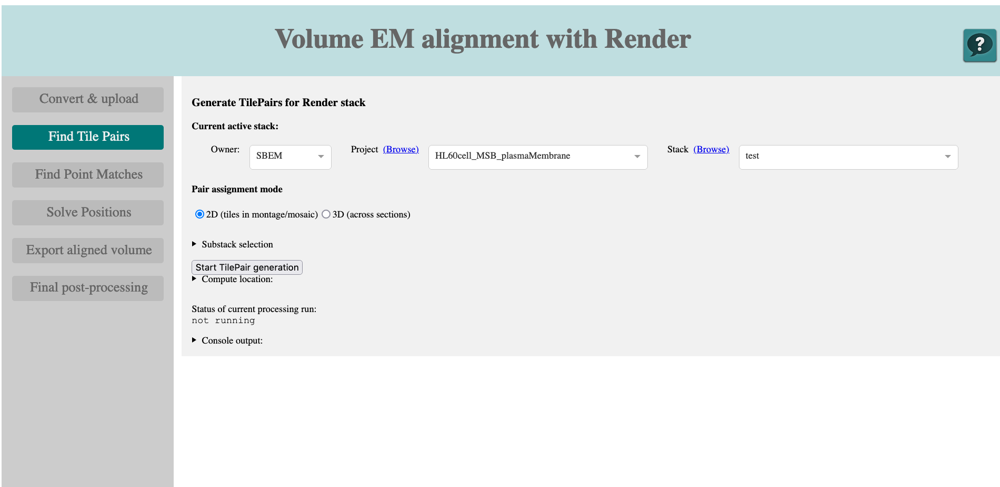

# Volume image alignment with Render

The design of the main window, where you control and run the alignment workflow is inspired by [IMOD's](https://bio3d.colorado.edu/imod/) [`etomo`](https://bio3d.colorado.edu/imod/doc/etomoTutorial.html) main window showing the sequential main steps of the procedure in the menu column on the left and all important parameter settings belonging to the current active steps in the main page.

## Data import - convert

The initial step in the alignment of volume data is to import it into Render and convert the metadata and if necessary also the image data accordingly.

This page contains the following elements:

- **Type selector:** choose the type of volume EM data to convert. The rest of the page will adapt accordingly.

- The type-dependent import content (see below)

- **select Render Project** and **select Render stack:** Provide a Render project and stack name into which the metadata will be imported. **Create new Project** and **... Stack** define the names of new instances.

### SBEMImage

- **dataset root directory:** the directory path of the SBEMImage root directory. This is the one that contains the `tiles`, `overviews`, `workspace` and `meta` subfolders.
- **browse:** use this dropdown to browse the directory. To move up (`..`) multiple times, you have to close the selector (`x` on the very right) for each additional step up.

## Generate Tile Pairs

This step will tell Render which of the tiles are neighbours in `x` and `y`. It will then have a collection of pairs that it can try to match with each other all in parallel.

