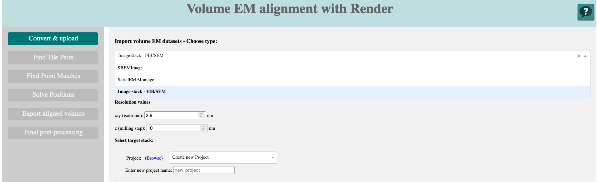

# Volume image alignment with Render

This document explains the usage of the Web UI to run volume EM alignment workflows using the ["Render"](https://github.com/saalfeldlab/render) infrastructure.

The design of the main window, where you control and run the alignment workflow is inspired by [IMOD's](https://bio3d.colorado.edu/imod/) [`etomo`](https://bio3d.colorado.edu/imod/doc/etomoTutorial.html) main window showing the sequential main steps of the procedure in the menu column on the left and all important parameter settings belonging to the current active steps in the main page.


Some features of the GUI display images generated by the Render web service. Most modern browsers will refuse to display those as the connection is not encrypted.


In order to enable the display,  the browser needs to be set to display `mixed content`.
In Firefox, you can enable this by clicking the little lock symbol left of the address bar and then set `HTTPS-Only Mode` to `Off`. 


For Chrome, try following these suggestions: https://9to5answer.com/how-to-get-chrome-to-allow-mixed-content

### Processing status 

At the bottom of each page, you will find a button to start the current task (that is disabled if information is missing). Below this button, you can select which compute resource you want to use (clicking the triangle expands the selection) and the status of the current run. Below is an expandable text box which displays the log file of the current processing run.


## Data import - convert

The initial step in the alignment of volume data is to import it into Render and convert the metadata and if necessary also the image data accordingly.



This page contains the following elements:

- **Type selector:** choose the type of volume EM data to convert. The rest of the page will adapt accordingly.

- The type-dependent import content (see below)

- **select target Stack:** select **Project** and **Stack:** Provide a Render project and stack name into which the metadata will be imported. **Create new Project** and **Create new Stack** define the names of new instances. If you use unsupported characters in your input, these will be automatically cleaned.

### SBEMImage

- **dataset root directory:** the directory path of the SBEMImage root directory. This is the one that contains the `tiles`, `overviews`, `workspace` and `meta` sub-folders.
- **browse:** use this dropdown to browse the directory. To move up (`..`) multiple times, you have to close the selector (`x` on the very right) for each additional step up.

### SerialEM Montage

- **dataset metadata file:** the path of the `idoc` file for the SerialEM (Super)Montage.

- **browse:** use this dropdown to browse the directory. To move up (`..`) multiple times, you have to close the selector (`x` on the very right) for each additional step up.

### Image stack - FIB-SEM

- **dataset root directory:** the directory path where the images are stored. They should be in aplphabetical order according to the layers.
- **Automatically crop black frame from images:** Whether empty content of the images (black) should be automatically cropped before import.
- **Append slices to existing stack:** Whether the current import images should be appended to an already existing stack.
- **Resolution values:** the pixel sizes in `x/y` and the section spacing in `z` in nm.

## Generate Tile Pairs

This step will tell Render which of the tiles are neighbours in `x` and `y` and also in `z`. It will then have a collection of pairs that it can try to match with each other all in parallel.

It will be necessary to perform this step multiple times: once for the neighbours in **`2D`**, and once across slices (**`3D`**, here you can choose how many neighbouring sections should be considered). This is needed because the image analysis algorithms likely need different parameters to work well, especially with an anisotropic datasets. In case the data changes significantly within a stack, you can also split up your data further using **Substack selection**.


## Generate/Update PointMatchCollection for Render stack

This is the most resource-demanding step of the procedure. Here we now like to find matching image areas in neighbouring tiles, the so-called **Point Matches**. This can be done using various image analysis methods like cross-correlation or [SIFT](https://en.wikipedia.org/wiki/Scale-invariant_feature_transform).

It will be necessary to perform this step multiple times: once for the neighbours in `x` and `y`, and once across slices. This is needed because the image analysis algorithms likely need different parameters to work well, especially with an anisotropic datasets. In case the data changes significantly within a stack, you can also split up your data further.


This page contains the following elements:

- **Tilepair source directory selector:** here you select the tile pairs you want to process. These are the results of the previous step and will be shown based on the stack selection.

- **Type selector:** choose the type of image analysis algorithm to use for determining the point matches. The rest of the page will adapt accordingly.

At the moment, only the SIFT client developed in Janelia that makes use of [Spark](https://en.wikipedia.org/wiki/Apache_Spark) for resource parallelization is implemented.

- **Select Match Collection:** The results of the analysis will be stored in a database (independent of the stack database). You can store as many runs into the same collection, even if they comprise the same pairs. If you want to add matches to an existing collection, select one. Otherwise, create a new one. The `Owner` should describe the nature and project of your dataset while the collection name would specify the stack and potentially some hint about the method(s) and parameters used for determining the matches.


### SIFT point matches

Each SIFT run requires several sets of parameters that control the information features that are extracted from each image as well as the criteria to match them.

Render provides a web interface where these parameters can be set and the quality of the matches as well as their compute time can be estimated for a single representative tile pair.

There is a small library of parameter templates available for several specimens. You can pick them from:

- **Organism Selector**

and

- **Match Trial Selector**


There are also two **Tile Viewers** where you can browse the stack and identify two neighbouring tiles to be used for the match trial.

If you click **Explore MatchTrial**, the parameters will be used to match the two example tiles and the Match Trial web interface will open in a new browser tab. It will show the results of the trial using the template parameters and the selected tiles.

If you are happy with the result, you can continue launching the procedure for all tiles. The TrialID will be automatically filled from this trial.

#### if you need to adjust parameters because the matches are not good:

Click **Create New Trial** at the top of the page. 


This will open the Parameter editor with the parameters defined in the template.


The tiles from the current stack should already be shown at the bottom of the page. If not, to make them available, you need to *copy and paste the link that is shown above each tile view* in the main UI into the two big text boxes at the bottom of the parameter interface.

Make sure that their relative position (`2D`) is correct in the `Clip Parameters` section.

Click `Run Trial` at the bottom of the page to see if the parameters work for your stack.

On the next page, you will see the results. At the bottom, the two tiles are shown with coloured circles or lines indicating the matching features. Also, it provides statistics and the time it took to derive the matches.


You want to make sure that the Standard Deviation of the matches is within your expectations. This depends on the pixel size and section spacing. Something close to 1 pixel is acceptable.

If the combined time of deriving features and matches is significantly higher than a few hundred ms (`2D`) or a few seconds (`3D`), it might be worth working with lower resolution images. This decreases the accuracy of the matching but makes it faster.

To change the scaling, modify the last part of the two image URLs in the large text boxes (`scale`) and run the trial again.

```
...&scale=0.4
```


If you are happy with the parameters, copy the long ID at the very end of the website address bar over to the Main UI.

```
...?matchTrialId=xxxxxxxxxxxxxxxxxxxx
```

There, ***paste it into the text box*** after **Use this Match Trial as compute parameters:**.

#### Compute the matches for all tilepairs

The parameters you just defined for the template tile pair will be used for all the tiles in the stack.

With the known number of tile pairs and the estimated run time for each pair from the trial, the necessary compute resources for the stack are predicted and can be checked in **Compute settings**.


Launching the computation will request the selected resources on the cluster and then launch a Spark instance on the allocated compute nodes that distributes and manages the parallel computation of the point matches.
You will receive an email once the computation starts (after allocation of the resources) and when it is done. It will tell you that the computation was `COMPLETED` if successful and give you error descriptions otherwise. If you get a message referring to a `TIMEOUT`, you have to re-run the computation with more generous resource settings.

## Solve Positions

Now that we have collected matching features for the tiles, these connections need to be compiled into a global solution positioning all tiles in 3D space to result in the aligned volume.


This page contains the following elements:

- **Select Match Collection:** select the match collection that you want to use to align your stack.

- **Explore Match Collection:** This link will lead you to Render's Web tool to visualize and browse match collections.


You will see a 3D graph containing all the tiles and their interconnections. The colours of the links represent the quality and weight of each connection and how it contributes to the global solution. You can also access metadata for each tile and its neighbours.

- **Explore tile/slice:** you can browse individual tiles or slices to determine the **substack selection**.

- **Select Output Render Stack:** The procedure will write a new stack into the existing project. Here you select the target stack.

-**Select Transform type:** Select a transformation type to be used for the solving. `rigid` or `TranslationModel` should match for most volume EM data (except ssTEM).

-**Select solve type:** You can choose between `2D` (inside one section only) and `3D` considering the full volume for the solve.


### Export Render stack to volume

You can export a Render stack at any time to disk ("materialize").


You can **explore slice** to determine the **volume region to consider**. Just drag the rectangle on top of the image. If you click **Zoom In**, the viewer and region boundary will adapt to the selection. **Reset Zoom** will bring the viewer back to displaying ther entrire setcion.

At the moment, `N5` or `slice images` are available as **output type**.

It is highly recommended to use N5 (and BDV or MoBIE for visualization) for large volumes or 2D slices. The slice export option can be chosen to produce downscaled images for talks or movie visualizations.


#### N5

Pick the desired **output path** and the result will appear in a subdirectory `aligned` with the date and a reference to the stack.

Make sure that the contrast in the slice viewer fits your expectations of the final data. If not, adjust it. The output data intensity will be scaled accordingly.

With the known number of tiles and the estimated run time for exporting a slice, the necessary compute resources for the stack are predicted and can be checked in **Compute settings**.


Launching the computation will request the selected resources on the cluster and then launch a Spark instance on the allocated compute nodes that distributes and manages the parallel computation of the point matches.
You will receive an email once the computation is done. It will tell you that the computation was `CANCELLED` but this only means that the resource allocation has been ended after successful computation of the matches. If you get a message referring to a `TIMEOUT`, you have to re-run the computation with more generous resource settings.

#### slice images

This will export your slice(s) into the desired **output file type** which can be either `jpg`,`png`or `tif`.

You can use **Choose output scale** to select the downscaling factor you like your export to have. The dimensions of the output images are shown in the status table in **Compute Settings**. There you can also choose the number of CPUs to use for parallel export.

## Finalize output format

Here you can finalize your data export (if `N5` was chosen for export) and generate the necessary metadata file to view the volume in BigDataViewer or MoBIE.
- **BDV-XML:** This will create the `XML`file necessary to view the result in *BigDataViewer*
- **MoBIE:** you can choose either an existing MoBIE project as output directory into which the aligned images will be added, or a new directory where the script will generate an entirely fresh MoBIE project.

- **Choose exported volume:** This provides a list of already exported volumes (in N5 format). The files have to still reside in the original location on the storage system.
