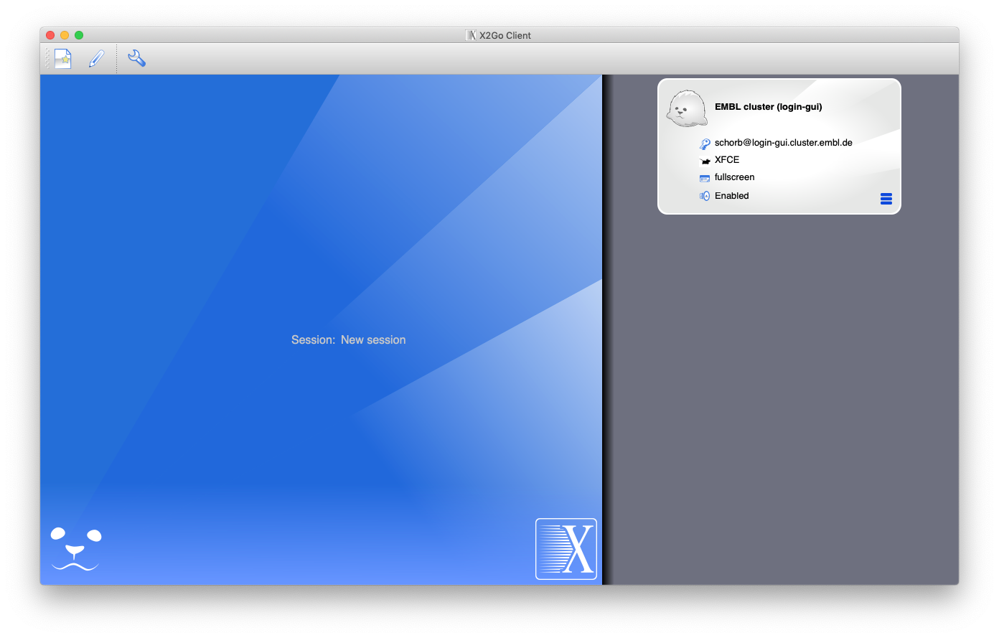
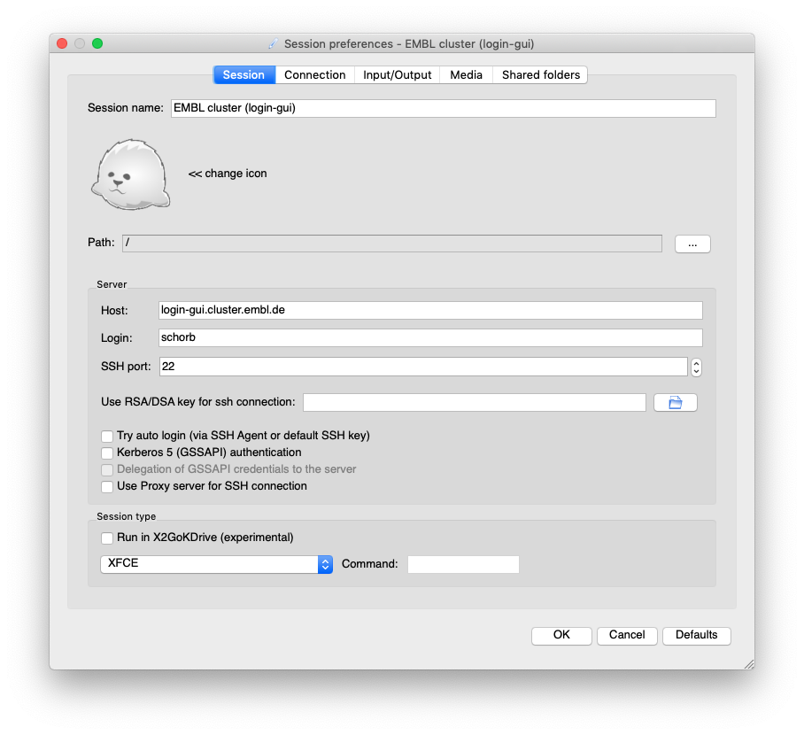
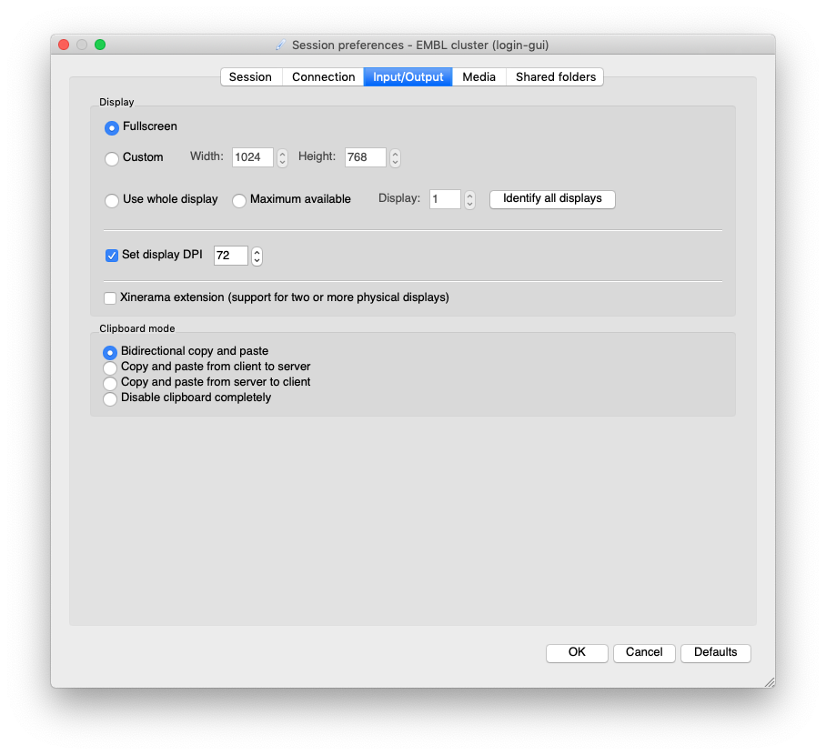
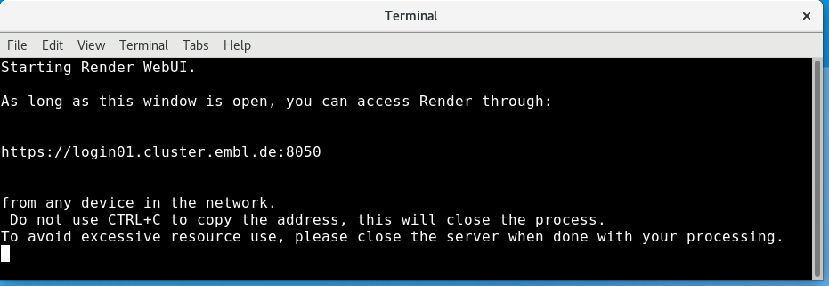
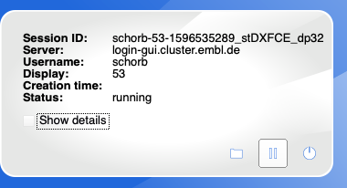

# Start the Render web UI on the EMBL Cluster

This tutorial explains how to launch the Render WebUI for running computations.

It makes use of the graphical login procedure for the EMBL cluster, described [here](https://wiki.embl.de/cluster/Env).


## Setting up x2go

Before you start, you need to install a client software to connect.
Just download x2goclient (available for Windows, Linux and Mac from [here](https://wiki.x2go.org/doku.php/doc:installation:x2goclient), (find the installer in ```releases```) and configure your session as follows.

When you first launch the program, you need to set up the connection. Click the white symbol in the top left corner to add a new connection.



Here, you should the following connection details with your user name:



If you want, you can also switch to the `Input/Output` tab to set up the display settings.




Once you have set up the connection, you can just launch it by double-clicking its box on the right side of the x2go main window. Put your password and you will get a graphical desktop on EMBL's cluster submission node.

## Launching Render

You should find an icon called `Render WebUI` on your desktop.


If you don't (some more recent EMBL users might need that), open a terminal by right-clicking in an empty area of the desktop and selecting `Open Terminal here`.
Then copy and paste this command and execute it by pressing `Return`.

```cp /g/emcf/schorb/code/admin_scripts/Render_WebUI.desktop ~/Desktop```

Now, the desktop icon should be there.

When you click the icon the following window appears:



You can now connect to the we address shown with any browser.

To close the WebUI, just close that window.

## Interrupting sessions

When you run a long processing, there is no need to stay connected with x2go all the time. You can simply disconnect from the VPN and re-connect at any later time. The session will continue to run as it is.

To follow the formally correct procedure, you can also click the `Pause` button at the bottom of the x2go status frame for your running connection. This will disconnect but not end your session.




## Connection problems


IT has upgraded the graphical login node for the cluster.
Therefore one connection setting has to be modified.
This only applies for machines where you have already used the X2go connection.

In this case you will get a "Host key cerification failed" error after accepting the (new) host key.


To fix this:

MAC:

- open a terminal
- type and run:
     open -a Textedit ~/.ssh/known_hosts
- in this file, remove the line that starts with "login-gui.cluster.embl.de"
- save the file


Windows:
- open a file explorer
- go to (type into the address bar) %USERPROFILE%\ssh
- open the file "known_hosts" with a text editor
- in this file, remove the line that starts with "login-gui.cluster.embl.de"
- save the file


Now, when connecting, X2go will ask you to accept the (new) host key. Hit yes and the connection should open.

## Happy processing!
